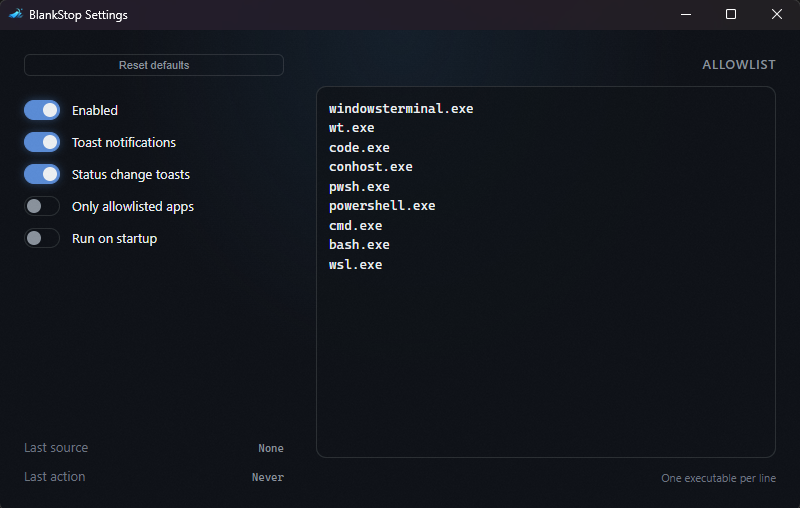
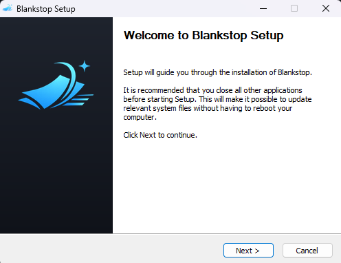

<p align="center">
  
</p>

<h1 align="center">Blankstop</h1>

<p align="center">
  <strong>Fix soft-wrapped clipboard text on Windows.</strong><br>
  No more <code>Invalid or unexpected token</code> when pasting LLM snippets or console output.
</p>

---

- **Automatic** — Runs in the system tray; fixes clipboard text as you copy.
- **Safe** — Only rewrites JavaScript/TypeScript if the result parses correctly.
- **Scoped** — Allowlist controls which apps can trigger changes.
- **Private** — Local-only; no telemetry or network calls.

<p align="center">
  
  &nbsp;&nbsp;&nbsp;
  
</p>

## Download

Get the latest Windows installer from [**GitHub Releases**](../../releases).

After installing, Blankstop starts as a tray app with no main window. Right-click the tray icon to access settings.

## How it works

1. Listens for clipboard changes via Win32 events (no polling).
2. If the source app is allowlisted, runs the sanitizer pipeline:
   - Normalizes line endings and strips invisible characters.
   - Detects shell-like blocks (including PowerShell/pwsh and heredocs) and repairs common paste damage.
   - Detects JS/TS-like code and attempts to reflow soft-wrapped lines.
   - **Only rewrites if the result parses as valid JavaScript** (parse oracle).
   - Falls back to conservative text cleanup for non-JS content.
3. Shows a brief toast when clipboard text is modified.

**Global shortcut:** `Ctrl+Alt+Shift+V` toggles enabled/disabled.

Validation examples: `docs/runbook/sanitizer_validation.md`.

## When Blankstop will NOT change your clipboard

- Disabled via tray or settings.
- Pause is active.
- Source app is not in the allowlist (when `only_allowlisted` is on).
- JS parse validation failed — original text is preserved.
- No material changes after cleanup.

## Settings

Access via tray menu → Settings.

| Option | Description |
|--------|-------------|
| Enabled | Master on/off switch |
| Toast enabled | Show notification on clipboard change |
| Only allowlisted | Restrict to specific apps |
| Allowlist | One exe name per line (e.g., `windowsterminal.exe`) |
| Run on startup | Launch at Windows login |

## Development

```bash
pnpm install          # Install dependencies
pnpm tauri dev        # Run in dev mode (Windows)
pnpm tauri build      # Build installer
```

**WSL users:** Sync to Windows with `scripts/sync_to_windows.sh` before running.

## Security & privacy

- **Local-only:** No telemetry, no network calls for clipboard data.
- **Allowlist default:** Only allowlisted apps can trigger changes.
- **Conservative rewrites:** Clipboard is only modified when the sanitizer produces a validated, material change.
